# DeepMReye-RS
Kod źródłowy i materiały dodatkowe do pracy licencjackiej: Zastosowanie modeli uczenia głębokiego do ekstrakcji ruchów gałek ocznych o małej amplitudzie z sygnału fMRI.

## Pliki notebooków

### `1-Base_model_training.ipynb` - Trening modelu bazowego

Trenuje wyjściową wersję modelu **DeepMReye** na połączonym zbiorze danych guided-fixation
(DS1–5) oraz resting-state (RS), łącznie 233 sesje treningowe i 60 testowych.
Trening trwa 1 epokę z 5 000 krokami i domyślną funkcją straty Euklidesowej.

---

### `2-Training_rs_on_base_model.ipynb` - Trening modelu na danych resting-state

Trenuje model DeepMReye od zera wyłącznie na danych resting-state (18 sesji
treningowych / 5 walidacyjnych / 6 testowych) z użyciem złożonej funkcji straty
Huber + Pearson (z modułu `smooth_loss.py`). Hiperparametry (lr=4.57e-05,
smooth_l1_delta=0.05, dropout_rate=0.25) pochodzą z najlepszej konfiguracji znalezionej
przez Ray Tune. Notebook zawiera oddzielną ewaluację na zbiorze treningowym
(sprawdzenie przeuczenia) i testowym (generalizacja).

---

### `3-Hyperparameter_tunning.ipynb` - Optymalizacja hiperparametrów (Ray Tune)

Przeprowadza 30-próbkowe przeszukiwanie przestrzeni hiperparametrów za pomocą biblioteki
Ray Tune na danych stanu spoczynkowego. Przeszukiwany zakres: learning rate, smooth_l1_delta,
gaussian_noise, dropout_rate, loss_confidence. Najlepsza znaleziona konfiguracja:
`lr=9.85e-06, smooth_l1_delta=0.03, gaussian_noise=0.01, dropout_rate=0.1`.
Po przeszukiwaniu model jest trenowany z tą konfiguracją i ewaluowany osobno na
zbiorze treningowym i testowym.

---

### `4-Transfer_learning.ipynb` - Uczenie transferowe (29-fold CV)

Implementuje uczenie transferowe z zamrożonym backbonem: wagi warstw splotowych
są ładowane z modelu bazowego i blokowane, a dotrenowywane są tylko warstwy gęste.
Eksperyment używa 29-krotnej walidacji krzyżowej leave-one-subject-out i w każdym
foldzie 28 podmiotów służy do treningu, 1 do walidacji.

**Wyniki:** Mean Pearson r = 0.564 ± 0.338 (zakres: −0.18 do +0.975).

---

### `smooth_loss.py` - Niestandardowa funkcja straty i trening

Moduł pomocniczy importowany przez notebooki 2–4. Zawiera trzy komponenty:

**`create_model_with_smoothl1(input_shape, opts, is_resting_state)`**
Buduje model DeepMReye z zamienioną funkcją straty. Zamiast domyślnej straty
euklidesowej używa złożonej funkcji straty.

*SmoothL1 (Huber):* zachowuje się jak MSE dla małych błędów (< `smooth_l1_delta`)
i jak MAE dla dużych — jest odporniejsza na wartości odstające niż czyste MSE.
*Składnik Pearsona:* penalizuje brak korelacji między predykcją a rzeczywistością,
niezależnie od bezwzględnej skali.

Model śledzi trzy metryki podczas treningu: `smoothl1_loss`, `confidence_loss`, `pearson_r`.

**`train_model_with_smoothl1( )`**
Główna funkcja treningowa. Kluczowe cechy:
- **Learning rate scheduler**: krokowy zanik LR
- **EarlyStopping**: zatrzymuje trening jeśli `val_smoothl1_loss` nie poprawia się
  przez 20 epok, przywraca najlepsze wagi (`restore_best_weights=True`)
- **Transfer learning**: opcjonalne wczytanie wag z pliku `.h5`
  (`pretrained_weights`) i zamrożenie wszystkich warstw poza `fc` i `confidence`
  (`freeze_backbone=True`)

**`pearson_loss_tf(y_true, y_pred)`**
Implementacja straty Pearsona w TensorFlow: centruje obie zmienne względem średniej,
liczy korelację i zwraca `1 − mean(r)`, co daje 0 dla idealnej predykcji.

---

### `5-Waskie_gardlo_cechy.ipynb` - Dekodowanie przez cechy wąskiego gardła

Zamiast korzystać z wyjścia modelu, wyciąga pośrednią reprezentację i używa jej jako wejścia do regresji ridge.

Etapy:
1. Korelacja każdej cechy z pozycją wzroku → wybór 200 najlepiej skorelowanych cech
2. **Dekodowanie wewnątrzpodmiotowe** (5-fold KFold CV) - model trenowany i testowany
   na danych tego samego podmiotu
3. **Dekodowanie międzypodmiotowe** (leave-one-subject-out) — czy cechy generalizują
   między podmiotami?

---

## Wizualizacje (`figures/`)

---

### Notebook 1 - Model bazowy

#### `1-High_amplitudes_results.png`

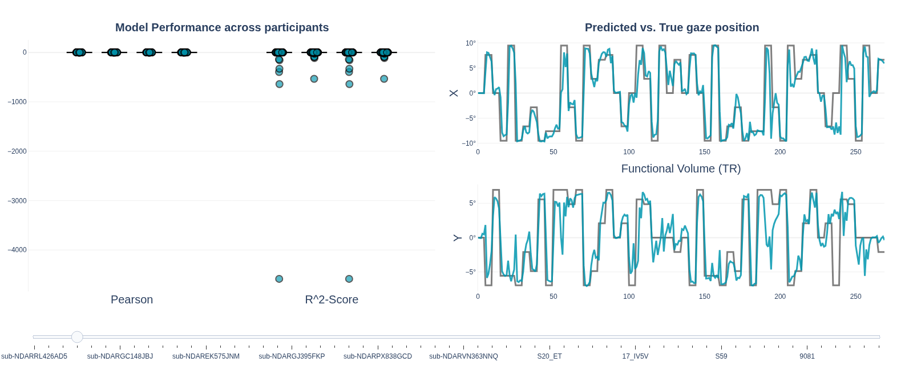

Lewy panel - wyniki modelu (Pearson r i R²) dla każdego podmiotu
; prawy panel - przykładowy
szereg czasowy predykcji vs rzeczywistość dla osi X i Y dla danych o dużych amplitudach.

Predykcje śledzą rzeczywiste położenie wzroku z dobrą
dokładnością - krzywe są wyraźnie zsynchronizowane.

---

#### `1-Low_amplitudes_results.png`

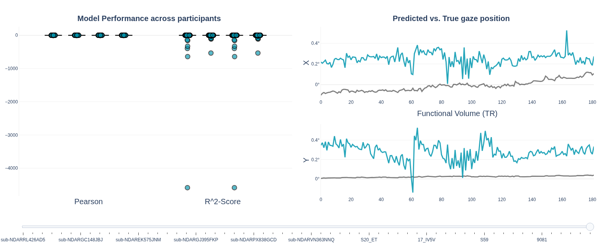

Analogiczny wykres, ale dla sesji z małymi amplitudami ruchu.
Predykcje znacząco odbiegają
od rzeczywistego położenia wzroku (szare linie, bliskie 0°). Model „domyśla" się ruchów,
których faktycznie nie ma.

---

### Notebook 2 - Trening na resting-state

#### `2-Training_and_validation_lines.png`

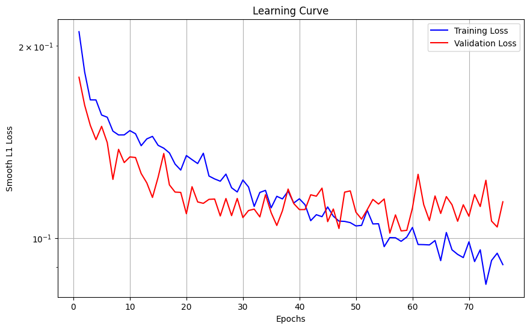

Krzywa uczenia - strata treningowa (niebieska) i walidacyjna
(czerwona) w funkcji epok.

Obie krzywe zbiegają się od ~0.2 do ~0.1. Strata treningowa
spada poniżej walidacyjnej pod koniec (≈epoka 60-75), co sygnalizuje lekkie przeuczenie.

---

#### `2-Training_data_evaluation.png`

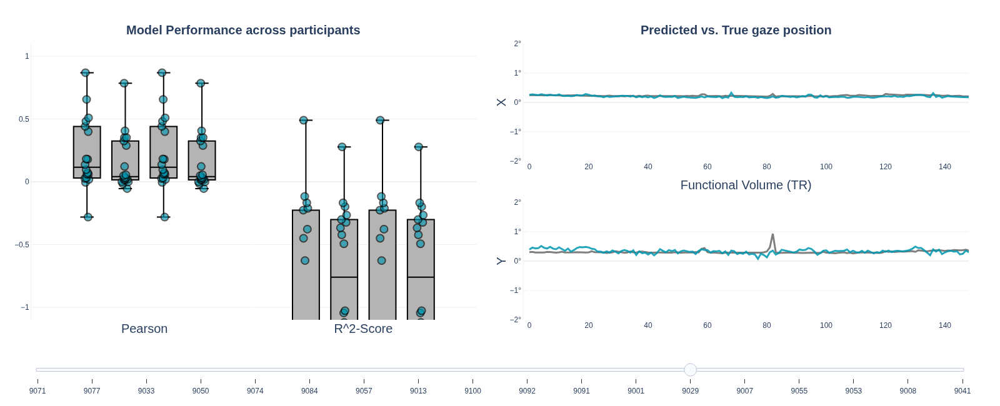

Wyniki ewaluacji na zbiorze treningowym (18 sesji RS):
boxploty Pearson r i R²-Score per podmiot + przykładowy szereg czasowy.

Pearson r skupia się wokół 0.1–0.4 z dużą wariancją.

---

#### `2-Test_data_evaluation.png`

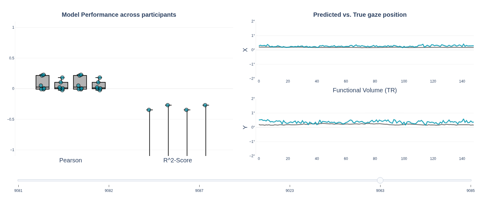

Wyniki na zbiorze testowym (6 sesji RS, podmioty niewidziane
podczas treningu).

Pearson r bliski 0, R² mocno ujemny. Predykcje są niemal stałe i nie śledzą ruchów gałek ocznych. Model fine-tunowany
wyłącznie na 18 sesjach RS nie generalizuje na nowe podmioty.

---

### Notebook 3 - Optymalizacja hiperparametrów

#### `3-Train_hyperparameter_tunning.png`

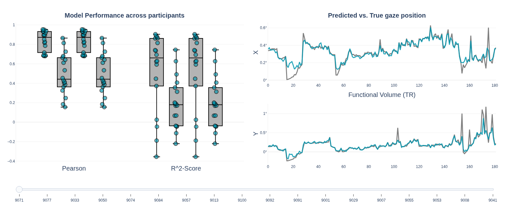

Wyniki na zbiorze treningowym po wybraniu najlepszej konfiguracji
z Ray Tune. Boxploty Pearson r (0.4–0.8) i R² (0.2–0.8) + szereg czasowy predykcji.

Na danych treningowych model z najlepszymi hiperparametrami
osiąga wysokie Pearson r. Predykcja widocznie śledzi rzeczywiste
położenie wzroku dla osi X i Y. Wskazuje to na dobrą zdolność dopasowania do danych
treningowych.

---

#### `3-Test_hyperparameter_tunning.png`

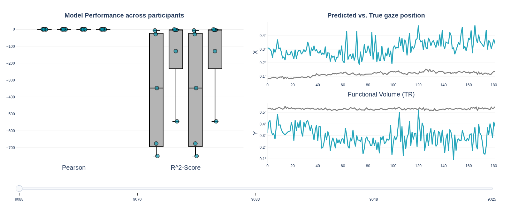

Wyniki na zbiorze testowym z najlepszą konfiguracją Ray Tune.

Pearson r ≈ 0 dla wszystkich podmiotów testowych, R²
silnie ujemny (do −700). Predykcje nie śledzą rzeczywistego położenia wzroku. Optymalizacja hiperparametrów poprawiła
wyniki treningowe, ale nie rozwiązuje problemu z nową osobą.

---

### Notebook 4 - Transfer learning (29-fold CV)

#### `4-Krzywe_straty_per_fold.png`

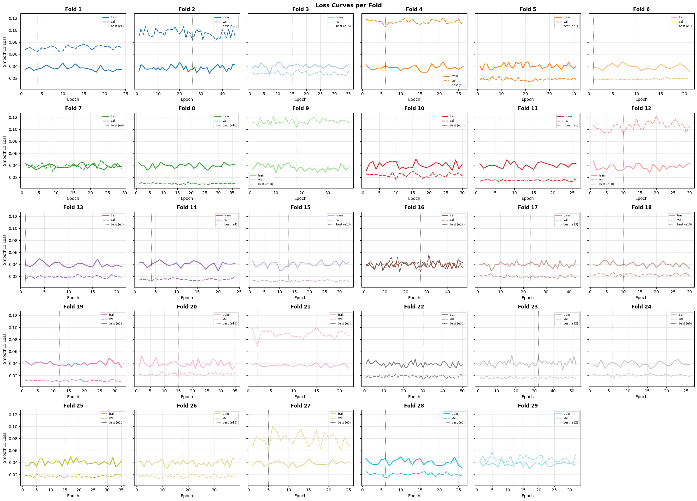

Siatka 29 paneli - po jednym na każdy fold CV. W każdym panelu:
linia ciągła = strata treningowa, przerywana = walidacyjna, kropkowana pionowa = najlepsza epoka.

Większość foldów wykazuje regularny spadek obu krzywych. Pionowe linie
pokazują, że model wybiera wczesne zatrzymanie w różnych momentach dla różnych foldów,
co odzwierciedla specyficzność podmiotową.

---

#### `4-Pearson_r_i_strata.png`

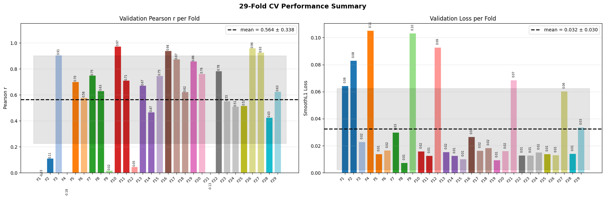

Podsumowanie 29-fold CV. Lewy panel - słupki Pearson r dla każdego
foldu (mean = 0.564 ± 0.338). Prawy panel - walidacyjna strata
SmoothL1 per fold (mean = 0.032 ± 0.030).

Ogromna rozpiętość r: od −0.18 do 0.975. Wysoka wariancja między foldami nie oznacza złego modelu,
lecz silną specyficzność podmiotową sygnału RS.

---

#### `4-Pearson_r_w_czasie epok.png`

Krzywe Pearson r w czasie treningu dla wszystkich 29 foldów.

Większość foldów rośnie w górę przez pierwsze 20–40 epok,
a następnie stabilizuje się lub fluktuuje.

---

#### `4-Sprawdzenie_overfittingu.png`

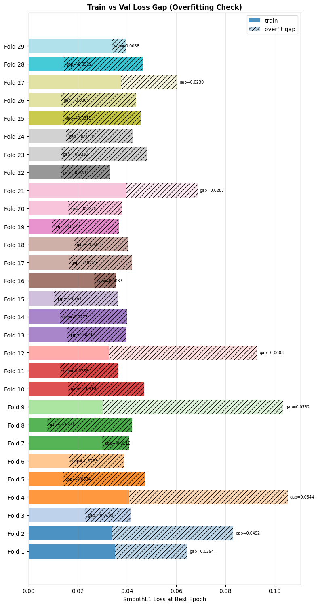

Poziomy wykres słupkowy per fold: kolor pełny = strata treningowa
w najlepszej epoce, kreskowanie = luka do straty walidacyjnej.

Większość foldów ma dosyć małą lukę, co jest akceptowalne.
Foldy 4, 9 i 12 mają znacznie większą lukę -  te podmioty są trudniejsze do nauczenia się
i model dopasowuje się do nich zbyt agresywnie.

---

### Notebook 5 - Cechy wąskiego gardła

#### `5-Pearson_r_per_podmiot.png`

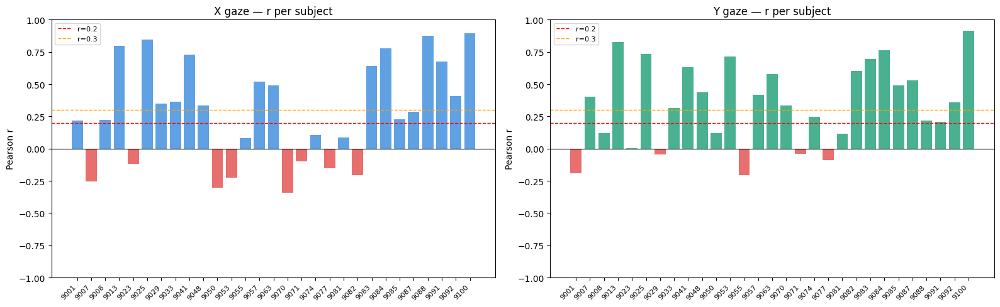

Słupki Pearson r z dekodowania **wewnątrzpodmiotowego** dla osi X
(niebieski) i Y (zielony) oddzielnie. Czerwone słupki
= r < 0. Przerywane linie = progi r = 0.2 i r = 0.3.

Wiele podmiotów przekracza r = 0.3 dla obu osi, co wskazuje
na realne cechy dekodalności.
---

#### `5-X_gaze_within.png`

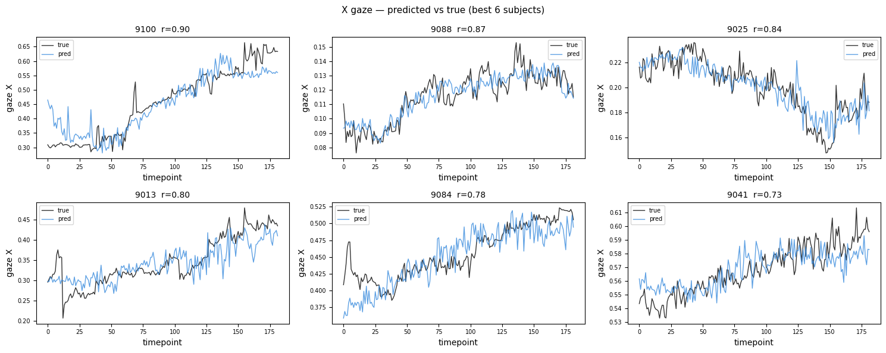

Szeregi czasowe dekodowania X dla **6 najlepszych
podmiotów** w dekodowaniu wewnątrzpodmiotowym. Czarna linia = rzeczywiste gazowanie,
niebieska = predykcja.

Predykcja wyraźnie śledzi wolne trendy i część szybkich zmian
położenia wzroku. Wysoki r świadczy o tym, że cechy wąskiego gardła naprawdę kodują pozycję
wzroku.

---

#### `5-Y_gaze_within.png`

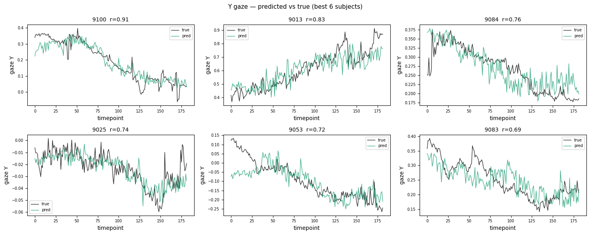

Odpowiednik powyższego wykresu dla **osi Y** .

Analogiczne wnioski jak dla X - predykcja osi Y jest zbliżona
jakościowo.
---

#### `5-X_Y_joint_per_subject.png`

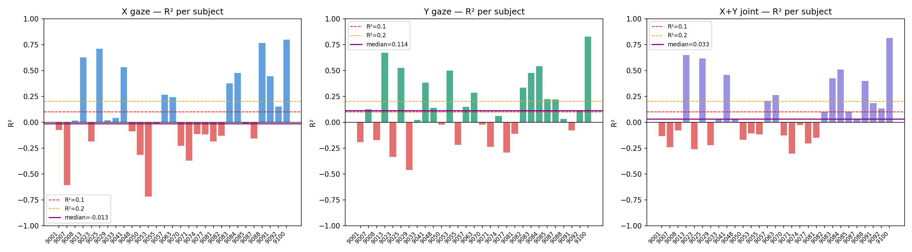

Trzy panele słupkowe: R² dla osi X (median = −0.013), Y (median = 0.114)
i łącznie X+Y (median = 0.033). Kolor = kierunek (pozytywny/negatywny), linie
przerywane = progi, linia fioletowa = mediana.

R² jest silnie zależny od skali predykcji - niska mediana wynika z niedopasowania skali predykcji do rzeczywistości. Niektóre podmioty mają R² > 0.5–0.7,
pokazując, że dla nich regresja ridge jest dobrze skalibrowana.

---

#### `5-r2_violin.png`

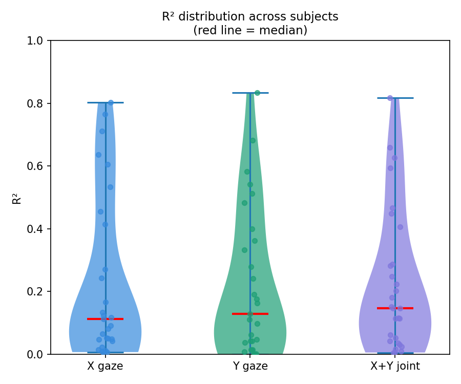

Wykresy skrzypcowe rozkładu R² we wszystkich 29 podmiotach dla X
(niebieski), Y (zielony) i X+Y łącznie (fioletowy). Czerwona linia = mediana,
punkty = poszczególne podmioty.

Rozkłady są prawoskośne — dużo podmiotów skupia się przy R² ≈ 0,
ale długi ogon sięga 0.8. Y ma wyższy rozkład mediany niż X.
---

#### `5-scatter_predicted_true_x.png`

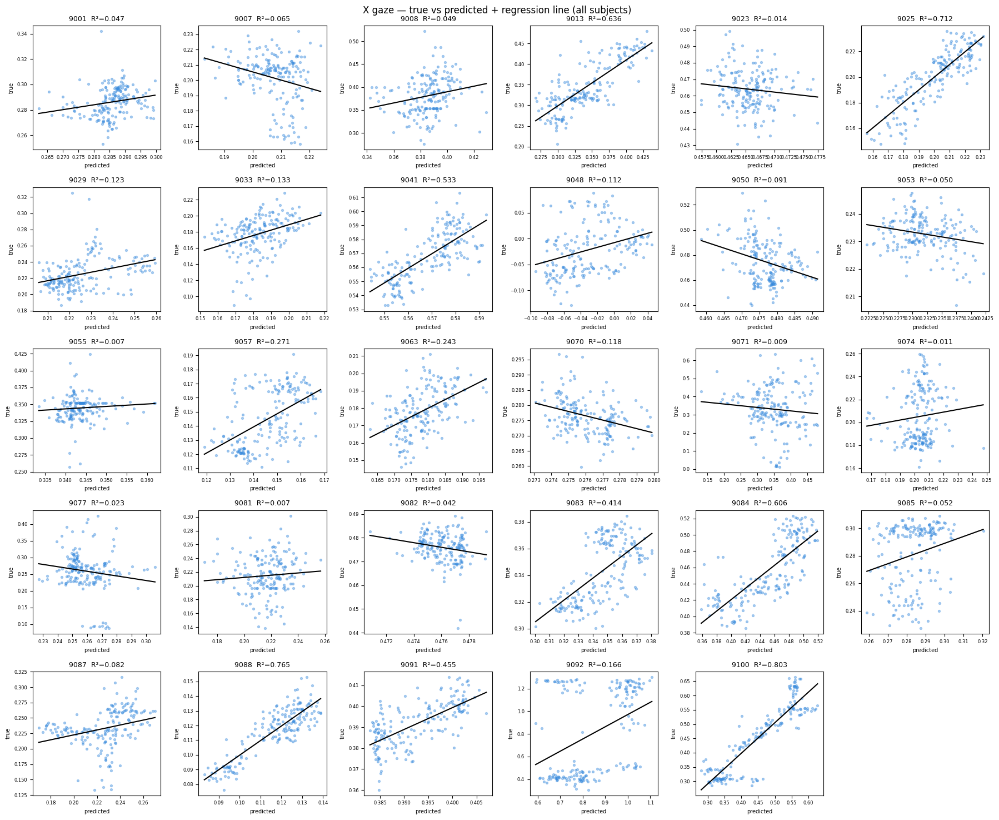

Siatka 29 wykresów punktowych - oś X = predykcja,
oś Y = rzeczywiste X. Czarna linia = dopasowanie regresji liniowej.

Panele z wyraźną przekątną linią
oznaczają dobrą korelację predykcja–rzeczywistość. Panele z poziomą lub chaotyczną
chmurą punktów = brak sygnału.

---

#### `5-scatter_predicted_true_y.png`

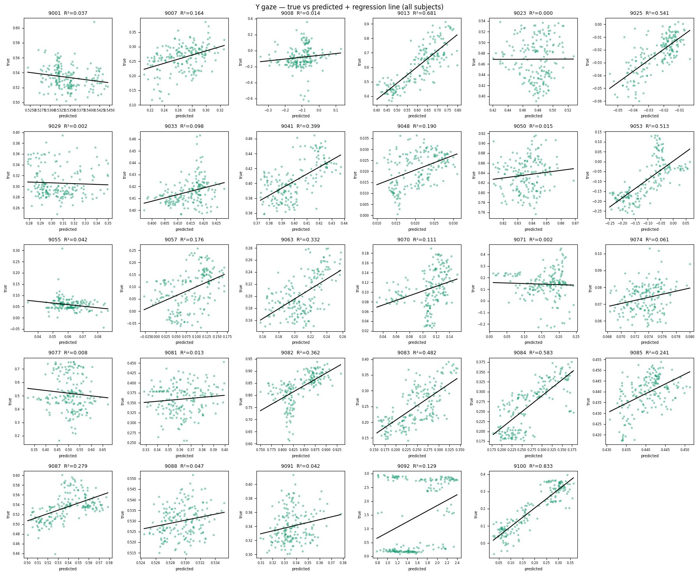

Analogiczna siatka scatter plotów dla osi Y.

Wnioski identyczne jak dla X. Dla najlepszych podmiotów linia regresji jest stroma i bliska przekątnej.

---

#### `5-across_subject_r_per_subject.png`

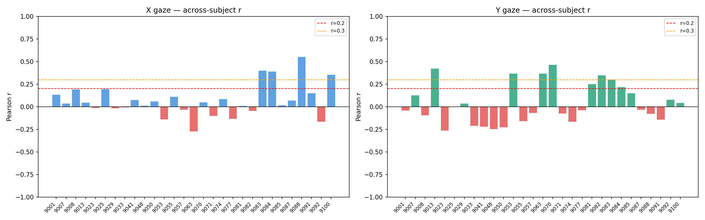

Pearson r z dekodowania **międzypodmiotowego** (leave-one-subject-out)
dla X (niebieski) i Y (zielony). Czerwone słupki = r < 0. Progi r = 0.2 i r = 0.3.

W porównaniu z dekodowaniem wewnątrzpodmiotowym widocznie
więcej podmiotów ma r < 0 lub bliskie 0. Kilka podmiotów przekracza r = 0.3 —
dla nich cechy wąskiego gardła kodują położenie wzroku w sposób uogólniający się na
niewidzianych podmiotach. Ogólnie wyniki across-subject są niższe, co potwierdza
silną specyficzność podmiotową sygnału resting-state.

